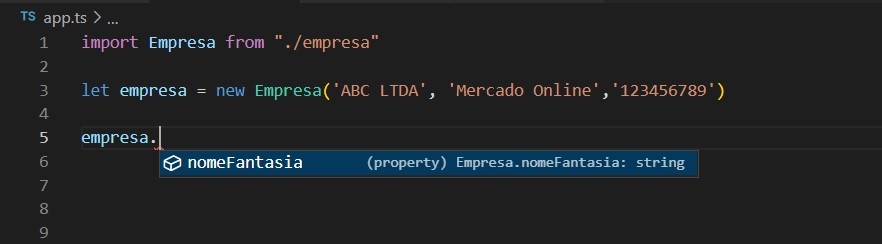
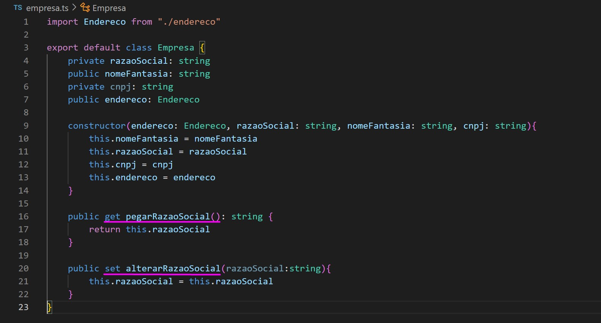
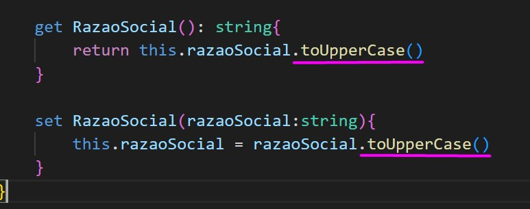
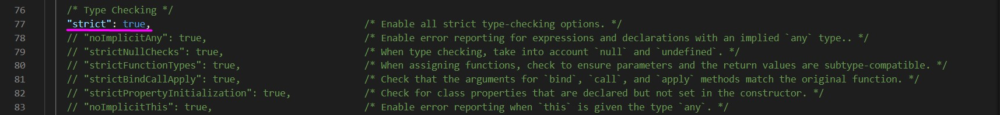
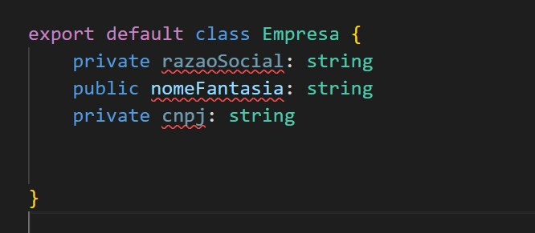
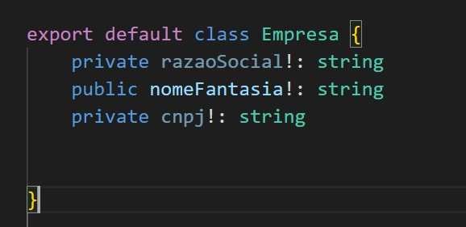

<h1 align="center">🔹Encapsulamento🔹</h1>

<br id="topo">

<p align="justify">Encapsulamento se refere ao agrupamento de dados, junto com os métodos que operam esses dados. Muitas linguagens de programação usam encapsulamento frequentemente na forma de classes.<br>
<br>
Encapsular dados, portanto, significa qualificar a forma de armazenar dados em objetos. Encapsulamento refere-se à restrição do acesso direto a alguns dos componentes de um objeto.<br>
<br>
<b>VANTAGEM</b>:<br>
<br>
O encapsulamento é um mecanismo de restrição do acesso direto a alguns componentes de um objeto, de forma que outros objetos não possam acessar os valores de todas as variáveis ou métodos de um objeto específico.<br>
<br>
O encapsulamento pode ser usado para ocultar ou proteger membros e métodos associados a uma classe ou objeto instanciado, do acesso direto de códigos externos.<br>
<br>
<b>COMO PROTEGER OS DADOS</b>?<br>
<br>
Para encapsular dados utiliza-se modificadores de acesso, palavras reservadas que modificam a forma de acesso aos dados. Desta forma, a linguagem TypeScript pode controlar se determinados métodos ou propriedades são “visíveis” aos códigos fora da classe.<br>
<br>
Como é possível perceber no código abaixo, a expressão <i>private</i> faz esse papel de limitar o acesso a determinado atributo:<br>
</p>

```
export default class Empresa {
    private razaoSocial: string
    public nomeFantasia: string
    private cnpj: string
    public endereco: Endereco
}
```

<p align="justify"><b>COMO O ACESSO É BLOQUEADO</b>?<br>
<br>
Os atributos privados deixam de ser visíveis para fora do objeto e portanto, não podem ser modificados diretamente. Os demais atributos públicos, que continuam visíveis, são modificáveis diretamente:<br>
</p>

<p align="center">

</p>

<p align="justify">Para a linguagem TypeScript existem três modificadores de acesso: <i>private</i>, <i>protected</i> e <i>public</i>. A visibilidade padrão dos membros de uma classe é pública, ou seja, modificada pela palavra-chave "public". Um membro público pode ser acessado em qualquer lugar.<br>
<br>
<b>IMPORTANTE!</b><br>
<br>
Quando não se declara o modificador o padrão aplicado é <i>public</i>.<br>
<br>
Lembrando que encapsular não significa nunca mais acessar, mas sim acessar com restrição. A forma de fazer isto é através de métodos. Lembre-se que o objetivo do 
encapsulamento é modificar a forma de acesso aos dados. O modificador <i>private</i> bloqueia completamente a visibilidade de um membro da classe a qualquer código fora do próprio corpo da classe.<br>
</p>

→ [Voltar ao topo](#topo)

## MÉTODOS GET E SET

<p align="justify">Existem várias convenções entre os desenvolvedores que utilizam o paradigma de programação orientada à objetos. Uma delas é o uso de métodos get e set. A convenção está na 
nomenclatura dos métodos.<br>
<br>
<b>Métodos <i>get/set</i></b> são usados para <b>acessar propriedades privadas</b> e também outros valores que devam ser calculados.<br>
<br>
Segue um exemplo de aplicação desses métodos:<br> 
</p>

<p align="center">

</p>

<p align="justify">Este tipo de implementação permite o acesso aos métodos como se fossem propriedades.<br>
</p>

→ [Voltar ao topo](#topo)

## Campos readonly

<p align="justify">Campos <i>readonly</i> (somente leitura) são propriedades que podem ser acessadas (ter seu valor lido), mas não podem ser modificadas, ou seja, ter seu valor alterado por códigos externos à classe.<br>
<br>
A atribuição de valor para um campo do tipo readonly pode ser feita no momento de sua declaração ou no método construtor.<br>
<br>
Usar o modificador de acesso readonly ajuda a diminuir o código da classe, pois não é preciso privar o campo para sua proteção e, também, declarar um método para obter seu valor.<br>
<br>
<b>OUTRA VANTAGEM DO ENCAPSULAMENTO</b>:<br>
<br>
O encapsulamento pode melhorar o tratamento e manutenção da qualidade dos dados. A exemplo do código abaixo, antes do atributo ser preenchido ou lido ocorre um “tratamento”:<br>
</p>

<p align="center">

</p>

→ [Voltar ao topo](#topo)

## Verificação Strict

<p align="justify">O transcompilador TypeScript (arquivo tsconfig.json) possui várias configurações, dentre elas existe a opção de verificação <i>strict</i>. Quando esta opção está habilitada, o transcompilador não permite que uma classe tenha campos declarados sem a certeza de sua inicialização na construção do objeto.<br>
</p>

<p align="center">

</p>

→ [Voltar ao topo](#topo)

## Asserção de atribuição definitiva

<p align="justify">A asserção de atribuição definitiva (<i>definite assignment assertion</i>) é um recurso que permite forçar a declaração de um campo, em uma 
classe, mesmo que ele não tenha inicialização durante a construção do objeto.
Para isso, adiciona-se um sinal de <b>!</b>, na declaração do campo:<br>
<br>
Antes:</p>

<p align="center">

</p>

<p align="justify">Depois:<br></p>

<p align="center">

</p>

→ [Voltar ao topo](#topo)
